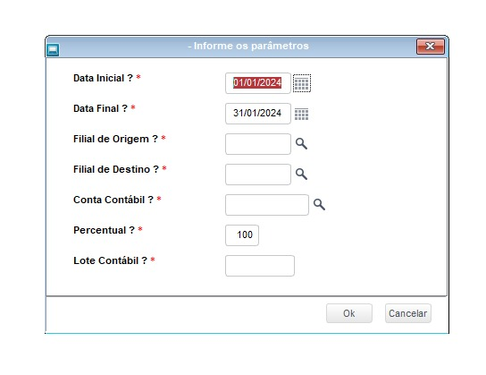
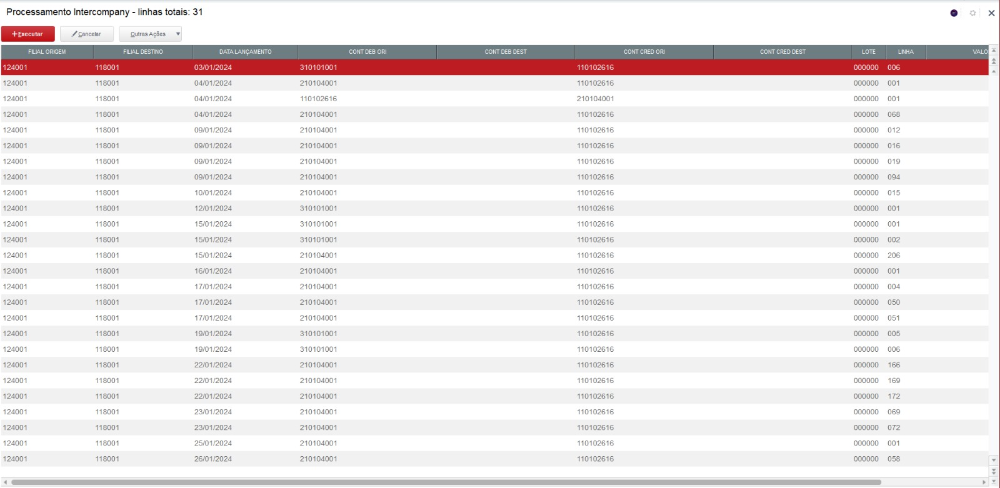
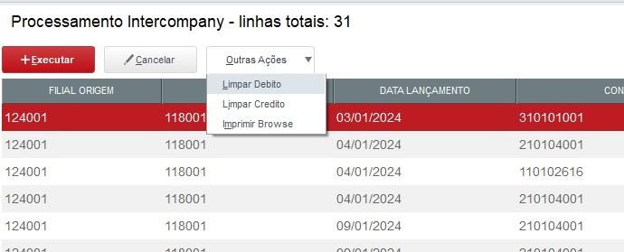

# 🔄 Rotina de Intercompany

## 📝 Descrição

Essa rotina personalizada foi criada para facilitar o processo de lançamentos contábeis entre empresas (Intercompany). Abaixo, seguem as etapas e exemplos visuais da interface da rotina.

---

### 1. 📅 Parâmetros Iniciais

Antes de iniciar o processamento, é necessário definir alguns parâmetros fundamentais. Esses parâmetros incluem:
- Data Inicial e Final
- Filial de Origem e Destino
- Conta Contábil
- Percentual
- Lote Contábil

---

### 2. 📊 Interface de Processamento

Após definir os parâmetros, a rotina exibe uma lista com todos os lançamentos da filial de origem, possibilitando ao usuário visualizar e preencher os campos de débito e crédito.

---

### 3. ⚙️ Ações Extras

A interface também permite realizar ações adicionais:
- **Limpar Débito**
- **Limpar Crédito**
- **Imprimir Browser**

---

### 4. ⚠️ Alerta de Preenchimento

Caso algum campo obrigatório, como as contas de débito ou crédito, não esteja preenchido, a rotina exibe uma mensagem de aviso solicitando o preenchimento para continuar.

---

### 5. 🔁 Opção de Replicação de Conta

Se o usuário desejar replicar uma conta inserida para os demais lançamentos com o mesmo valor, a rotina exibe uma confirmação para agilizar o processo.

---

### 6. ✅ Mensagem de Finalização

Após concluir o processo, é exibida uma mensagem informando a quantidade de lançamentos integrados com sucesso e orientando o usuário a executar o reprocessamento para atualizar os saldos contábeis.

